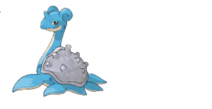
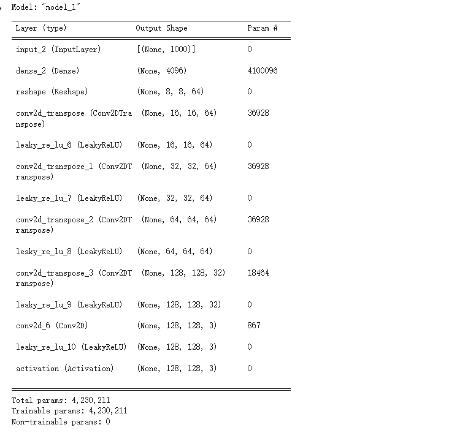

[TOC]

### 1变分自编码器基础

变分自动编码器（**VAE**, **V**ariational **A**uto - **E**ncoder）是一种基于自编码器结构的深度生成模型。

#### 1.1自编码器

自编码器是一种先把输入数据压缩为某种编码，后仅通过将该编码重构出原始输入的结构。从描述上看，自编码器是一种无监督方法。AE的结构分为一个压缩编码的Encoder和对应的解码重构的Decoder。


Encoder能够将给定的输入X映射为编码Z,也就是Z=g(X)。Decoder能够将编码Z映射回原输入的相似的$\hat{X}$。也就是$\hat{X}=f(Z)$。

Z也被称为**隐变量**。隐变量的维度必须是远远小于X的，否则就达不到压缩编码的目的。

如果Decoder能够仅仅依赖Encoder生成的编码Z尽可能好的还原输入数据，那么就说明Z中真的存在某种能表征原始输入X的信息，甚至Z的每一维都可能对应着某个输入数据变化的具体含义，例如人脸的笑容、皮肤颜色等属性。

对于压缩编码和解码重构的结构，使用普通的神经网络，只需要让神经元的个数逐渐减少到编码的维度，再由编码的维度逐渐增大到原输入的维度。具体表示如下所示：


Encoder和Decoder的不一定是完全对称的, 甚至也不一定是同质的.

希望Auto Encoder所重构的输入$\hat{X}$和真正的输入${X}$之间的差距越小越好，所以通常使用均方误差来作为AE的损失函数。

损失函数为：
$$
\mathcal{L}_{M S E}=\|X-\hat{X}\|^{2}
$$
AE还有一种常见的变形，称为去噪自编码器(Denoising Auto - Encoder)。这种AE**在原始输入数据的基础上添加噪声**，然后再送到AE中，并且要求Decoder还原出不带噪声的输入数据。这就要求Encoder和Decoder具有更加强大的能力。去噪自编码器的结构如下：


#### 1.2变分自编码器

**变分自编码器**(**VAE**, **V**ariational **A**uto - **E**ncoder)从概率的角度描述隐空间与输入样本.

##### 隐变量 - 概率分布式

理想状态下的生成模型可以被描述为$\ X=g(Z)$.但是由于无法直接知道$p(X)$，所以需要引入隐变量Z来求。
$$
p(X)=\sum_{Z} p(X \mid Z) p(Z)
$$
如果我们能够把输入样本X编码得到的Z控制在我们已知的某个分布中，那么我们就可以从隐变量的分布中采样，解码得到生成内容$\hat{X}$。将样本的隐变量建模为概率分布，而不是像AE一样将隐变量看作是离散值。


上图中，AE将样本编码为离散的点, 而VAE将样本编码为概率分布, 直接点就是给隐变量**添加噪声**.

那么在Decoder解码时，从隐变量中随机采样，得到采样后的向量作为Decoder的输入。


如果假设$p(Z) \sim \mathcal{N}\left(\mu, \sigma^{2}\right)$，可以从其中采样得到$Z_{1}, Z_{2}, \ldots, Z_{n}$，然后由生成模型得到：$\hat{X}_{1}=g\left(Z_{1}\right), \hat{X}_{2}=g\left(Z_{2}\right), \ldots, \hat{X}_{n}=g\left(Z_{n}\right)$。

但是我们无法度量生成的结果$\left\{\hat{X}_{1}, \hat{X}_{2}, \ldots, \hat{X}_{n}\right\}$和样本数据$\left\{X_{1}, X_{2}, \ldots, X_{n}\right\}$之间的差异。因为我们不知道$Z_{k}, X_{k}, \hat{X}_{k}$之间的对应关系。没有$X, \hat{X}$分布的表达式，就没法通过对齐两者分布的方法来优化模型。

我们应该在给定真实样本$X_{k}$的情况下，假设存在分布$p\left(Z \mid X_{k}\right) \sim \mathcal{N}\left(\mu, \sigma^{2}\right)$。Decoder就可以把$p\left(Z \mid X_{k}\right)$中采样得到的$\mathrm{Z}_{k}$ 还原为 $X_{k_{1}}$ 这样保证 $Z_{k}, X_{k}, \hat{X}_{k}$ 之间可以对应。

尽管分布内采样到的隐变量的值**不完全相同**, 但都应该重建回相同的输出, 这也就是把**样本编码为概率分布**的真正含义:


**每一个样本都对应着一个自己专属的正态分布**，样本之间一定存在重合，当采样到两个样本的叠加区域时，解码的内容会变得介于两者之间，按照AE中的假设，隐变量的每个维度都可能有具体的含义。当满足这一假设时，在概率分布视角下的隐变量就可以等距采样，通过观察控制生成的内容。


从满月到半月等距采样, 应该能观察到由满月逐渐变到半月的所有月相.

对于每个分布的均值和方差是通过神经网络来求得的。用神经网络来直接你和样本对应的正态分布的均值和方差。


##### KL散度

神经网络很容易过拟合，学得方差为0，但是我们需要学到的Z是一个含有噪声的方差不为0的分布。

对于我们之前的假设 $p(Z \mid X) \sim \mathcal{N}\left(\mu, \sigma^{2}\right)$ 要更严格，不但要约束 $\sigma^{2} \neq 0$, 还要令方差不能太大，也不能太小

但如果假设 $p(Z \mid X) \sim \mathcal{N}(0, I)$, 还保证了模型的生成能力:
$$
\begin{aligned}
p(Z) &=\sum_{X} p(Z \mid X) p(X) \\
&=\sum_{x} \mathcal{N}(0, I) p(X) \\
&=\mathcal{N}(0, I) \sum_{X} p(X) \\
&=\mathcal{N}(0, I)
\end{aligned}
$$
在该条件下 $p(Z) \sim \mathcal{N}(0, I)$, 当脱离Encoder, 即不依靠输入样本 $X$ 时, 我们可以直接从 $\mathcal{N}(0, I)$ 中采样来生成可靠 的结果.

而约束$p(Z \mid X) $的方法是使用KL散度。
$$
D_{\mathrm{KL}}(P \| Q)=\mathbb{E}_{\mathrm{x} \sim P}\left[\log \frac{P(x)}{Q(x)}\right]=\mathbb{E}_{\mathrm{x} \sim P}[\log P(x)-\log Q(x)]
$$
**KL散度**(也称为**相对熵**)常用于度量两个分布之间的差异性, 假设P 为样本真实分布, Q 为模型预测的分布。

当 $P, Q$ 越接近时, $D_{\mathrm{KL}}(P \| Q)$ 就越小, 当 $P, Q$ 分布完全相同时, $D_{\mathrm{KL}}(P \| Q)$ 为 0 .

求解过程如下：
$$
\begin{aligned}
& K L\left(N\left(\mu, \sigma^{2}\right) \| N(0,1)\right) \\
=& \int \frac{1}{\sqrt{2 \pi \sigma^{2}}} e^{-(x-\mu)^{2} / 2 \sigma^{2}}\left(\log \frac{e^{-(x-\mu)^{2} / 2 \sigma^{2}} / \sqrt{2 \pi \sigma^{2}}}{e^{-x^{2} / 2} / \sqrt{2 \pi}}\right) d x \\
=& \int \frac{1}{\sqrt{2 \pi \sigma^{2}}} e^{-(x-\mu)^{2} / 2 \sigma^{2}} \log \left\{\frac{1}{\sqrt{\sigma^{2}}} \exp \left\{\frac{1}{2}\left[x^{2}-(x-\mu)^{2} / \sigma^{2}\right]\right\}\right\} d x \\
=& \frac{1}{2} \int \frac{1}{\sqrt{2 \pi \sigma^{2}}} e^{-(x-\mu)^{2} / 2 \sigma^{2}}\left[-\log \sigma^{2}+x^{2}-(x-\mu)^{2} / \sigma^{2}\right] d x \\
=& \frac{1}{2}\left(-\log \sigma^{2}+\mu^{2}+\sigma^{2}-1\right)
\end{aligned}
$$
最小化KL散度用到的损失函数为：
$$
\begin{aligned}
\mathcal{L} &=\mathcal{L}_{\text {Recon }}+\mathcal{L}_{\mathrm{KL}} \\
&=\mathcal{D}\left(\hat{X}_{k}, X_{k}\right)^{2}+K L\left(N\left(\mu, \sigma^{2}\right) \| N(0,1)\right)
\end{aligned}
$$
即重构损失和KL散度两部分。

##### 梯度断裂 - 重参数

我们想要用梯度下降来优化$\ p\left(Z \mid X_{k}\right)$ 的均值μ 和方差σ, 但”采样”这个操作是**不可导**的, VAE利用**重参数化技巧**(Reparameterization Trick)使得梯度不因采样而断裂.


 Z的导数可以写成:
$$
\begin{aligned}
& \frac{1}{\sqrt{2 \pi \sigma^{2}}} \exp \left(-\frac{(z-\mu)^{2}}{2 \sigma^{2}}\right) d z \\
=& \frac{1}{\sqrt{2 \pi}} \exp \left[-\frac{1}{2}\left(\frac{z-\mu}{\sigma}\right)^{2}\right] d\left(\frac{z-\mu}{\sigma}\right)
\end{aligned}
$$
说明 $(z-\mu) / \sigma^{2} \sim \mathcal{N}(0, I)$, 从\mathcal{N} ( ~ $\left.\mu, \sigma^{2}\right)$ 中采样, 就等价与从标准正态分布 $\mathcal{N}(0, I)$ 中采样出一个 $\epsilon$, 然后再通过 $Z=\mu+\epsilon \times \sigma$ 缩放回去. 采样的导致梯度断裂的锅就至给了 $\epsilon$ 这个无关变量, 使得 $\mu, \sigma^{2}$ 可以重新参与到梯度下降 中优化:


### 2构建VAE模型完成Pokemon的生成

#### 2.1数据集的下载

```
!wget --load-cookies /tmp/cookies.txt "https://docs.google.com/uc?export=download&confirm=$(wget --quiet --save-cookies /tmp/cookies.txt --keep-session-cookies --no-check-certificate 'https://docs.google.com/uc?export=download&id=1XvSDB1N2ytYZ6d_grMQrhRlmIsO746k6' -O- | sed -rn 's/.*confirm=([0-9A-Za-z_]+).*/\1\n/p')&id=1XvSDB1N2ytYZ6d_grMQrhRlmIsO746k6" -O Large.zip && rm -rf /tmp/cookies.txt
```


**数据解压**

```
!unzip Large.zip
```

**删除压缩包**

```
!rm *.zip
```


#### 2.2必要库的导入

```python
import numpy as np
import cv2
import os
from google.colab.patches import cv2_imshow
```

```python
image_files = os.listdir('pokemon_jpg/pokemon_jpg')
imgs = []
for image_file in image_files:
  img = cv2.imread('pokemon_jpg/pokemon_jpg/'+image_file)
  small_img = cv2.resize(img,(128,128))
  imgs.append(small_img)
```

**图片的展示**

```python
cv2_imshow(imgs[5])
```



```python
imgs = np.array(imgs,float)/255
```

#### 2.3网络模型的设计

```python
import tensorflow.keras as k
import tensorflow as tf
from tensorflow.keras.layers import Conv2D, Dense, Input, LeakyReLU, Flatten, Activation,Conv2DTranspose, Multiply, Add, GaussianNoise, Subtract, Reshape
from tensorflow.keras import Model
from tensorflow.keras.losses import binary_crossentropy,KLD
from tensorflow.keras.backend import abs
from tensorflow.keras.activations import relu
from tensorflow.keras.optimizers import Adam
```

##### 2.3.1设计Decoder

```python
e0 = Input((128,128,3))

e1 = Conv2D(32,3,2)(e0)
e2 = LeakyReLU()(e1)

e3 = Conv2D(64,3,2)(e2)
e4 = LeakyReLU()(e3)

e5 = Conv2D(64,3,2)(e4)
e6 = LeakyReLU()(e5)

e7 = Conv2D(64,3,2)(e6)
e8 = LeakyReLU()(e7)

e9 = Conv2D(64,3,2)(e8)
e10 = LeakyReLU()(e9)

e11 = Conv2D(64,3)(e10)
e12 = LeakyReLU()(e11)

e13 = Flatten()(e12)

mu = Dense(1000, activation=relu)(e13)
sigma = Dense(1000, activation=relu)(e13)

zero = Subtract()([sigma,sigma])
norm = GaussianNoise(1)(zero)

sigma_x_norm = Multiply()([sigma,norm])
enc_o = Add()([mu,sigma_x_norm])

encoder = Model(inputs = e0,outputs = enc_o)
```

**查看网络结构**

```python
encoder.summary()
```


**绘制Decoder网络结构**


##### 2.3.2设计Decoder

```
d0 = Input((1000))

d1 = Dense(4096)(d0)
d2 = Reshape((8,8,64))(d1)

d3 = Conv2DTranspose(64,3,2,padding='same')(d2)
d4 = LeakyReLU()(d3)

d5 = Conv2DTranspose(64,3,2,padding='same')(d4)
d6 = LeakyReLU()(d5)

d7 = Conv2DTranspose(64,3,2,padding='same')(d6)
d8 = LeakyReLU()(d7)

d9 = Conv2DTranspose(32,3,2,padding='same')(d8)
d10 = LeakyReLU()(d9)

d11 = Conv2D(3,3,padding="same")(d10)
d12 = LeakyReLU()(d11)

d13 = Activation('sigmoid')(d12)

decoder = Model(inputs=d0,outputs=d13)
```

**打印网络结构**

```python
decoder.summary()
```



**绘制网络结构**


##### 2.3.3模型的组合

```python
vae_input = Input(shape = (128,128,3))
encoded = encoder(vae_input)
vae_output = decoder(encoded)
vae = Model(inputs = vae_input,outputs = vae_output)
```

**打印模型的结构**

```python
vae.summary()
```


**绘制网络结构**

```python
tf.keras.utils.plot_model(vae)
```


##### 2.3.4定义损失

```python
def vae_loss(y_true,y_pred):
  #Maybe look into 'untangled VAE' or something like that.
  return KLD(y_true,y_pred) + binary_crossentropy(y_true,y_pred)
```

##### 2.3.5模型的编译

```python
vae.compile(
    optimizer = 'adam',
    loss = vae_loss,
    metrics=['accuracy','kullback_leibler_divergence','binary_crossentropy']
)
```

```python
encoder.compile(
    optimizer = 'adam',
    metrics=['accuracy','kullback_leibler_divergence','binary_crossentropy']
)
```

```python
decoder.compile(
    optimizer = 'adam',
    metrics=['accuracy','kullback_leibler_divergence','binary_crossentropy']
)
```

### 3VAE模型的训练

```
vae.fit(imgs,imgs,batch_size=200, epochs = 2000)
```


### 4VAE模型的预测

```
#真实照片
i = 78
pred = vae.predict(np.array([imgs[i]]))
cv2_imshow(imgs[i]*255)
```


```
#生成的照片
i = 78
pred = vae.predict(np.array([imgs[i]]))
cv2_imshow(imgs[i]*255)
```


### 5参考资料

[1]    https://adaning.github.io/posts/53598.html